https://ctfd.offshift.io/

Challenge: Web->Maze

```
maze corparate just started a new trading platform, let's hope its secure because I got all my funds over there
http://45.134.3.200:9000/
```

We are given a Web to hack. At first we have a login page. 

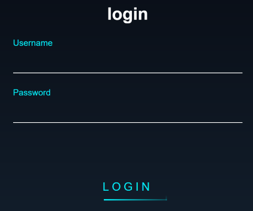

After trying some common combinations nothing happens, so looking the requests around in burp we can't see anything strange.

We tried robots.txt and it has some content inside

```
/sup3r_secr37_@p1
```

We enter that path: `http://45.134.3.200:9000/sup3r_secr37_@p1`

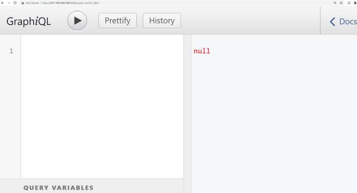

Luckily for us, this GUI can help us in going further searching through Graphql, because at the moment I know shit about that. So what to do here?

You can check the docs (button at top right) to know a bit more (or to start crying) or just put `{}` in the query and then, in between brackets, press 1.

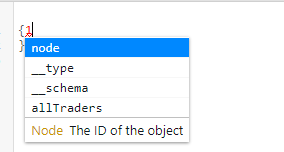

This GUI will help and show some useful querys you can do. So for example, click `allTraders` and press "Play"

It will autocomplete and add some more items to the query and this result will be shown

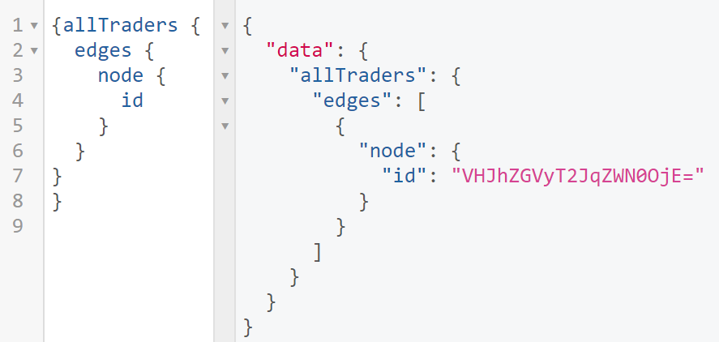

So right there we have an aparently base64 encoded string, which decodes to `TraderObject:1`. That's not much.

If you press enter after id (in node) and press 1 again, will show some more options. 

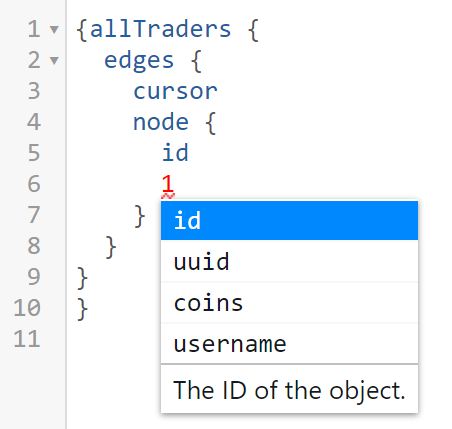

Add them all. After a while adding data, your query could look like this
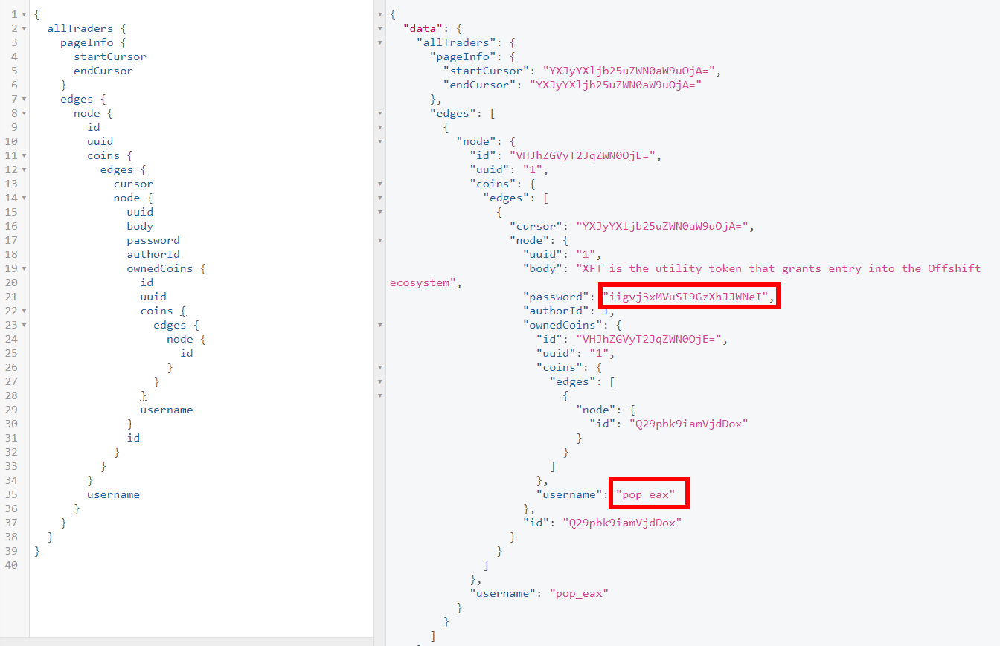

You can see there is a username and a password (is not base64). We tried login with `pop_eax` and `iigvj3xMVuSI9GzXhJJWNeI`  as password. Didn't work as espected so we tried XFT as username, and we are in.

We have some kind of admin panel (is it?) that looks like this

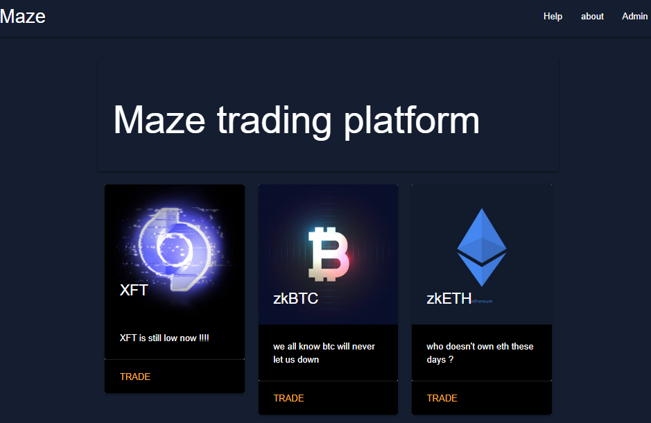

There is a Trade endpoint, if you check for SQLi like `trade?coin=eth%27` ( 27==' ), you get a 500 error (db engine tried to run the query and it breaks), and if you add -- (comments all what comes next in the query) you get the same page as trade?coin=eth. So it seems there is a SQL injection vulnerability there.

Gradually increasing our knowledge of the query with multiple test string like this:

`/trade?coin=eth%27%20or%20false--` returns the same result

`/trade?coin=eth%27%20or%20true--` returns other coin (XFT)

`/trade?coin=eth%27%20or%20true%20order%20by%201--` returns BTC, we ordered results by the first column (1)

`/trade?coin=eth%27%20or%20true%20order%20by%202--` returns XFT, we ordered results by the second column (2)

`/trade?coin=eth%27%20or%20true%20order%20by%203--` we ordered results by the third column (3), returns error 500, so there must be only 2 columns in current table

`/trade?coin=eth%27%20union%20select%20%271%27,%272%27--` we try to show constant values like 1 or 2

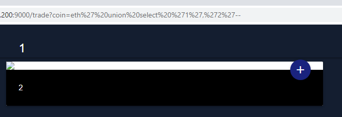

So how about showing other database fields from same and other tables?

`/trade?coin=eth%27+UNION+SELECT%20title,body+from+coins--` so there is a title and body fields in the table

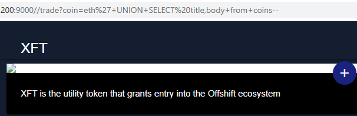

We managed to find there is a coins and admin table (and maybe there are others). So by running `/trade?coin=eth%27+UNION+SELECT%20username,password+from+admin--` we get a password.

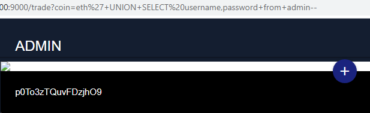

We go again to the admin section (top menu at the right) and with username `admin` and password `p0To3zTQuvFDzjhO9` we got intoanother panel

This is a real Maze.

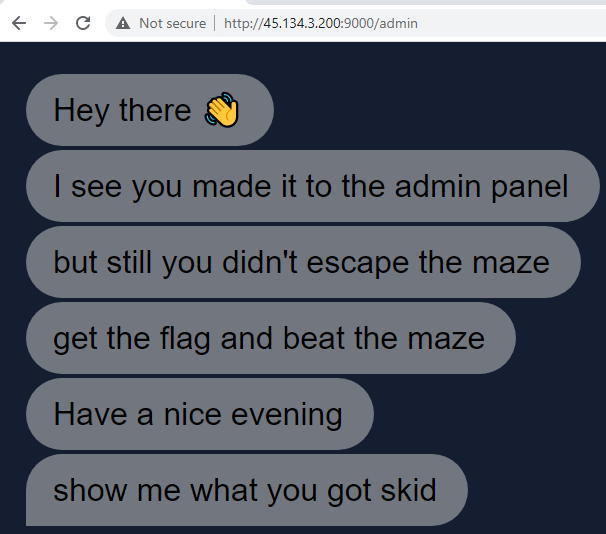

What to do here? Look at the source code.

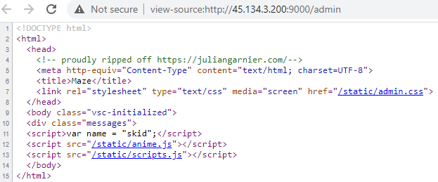

There are 2 scripts, a css and a javascript variable "name" with value "skid". Looking at scripts.js we can se that global variable name is acceded and appended to the message that was animated

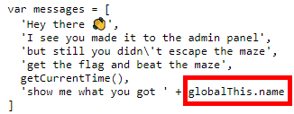

Looking at the request we saw a cookie was set with value skid.

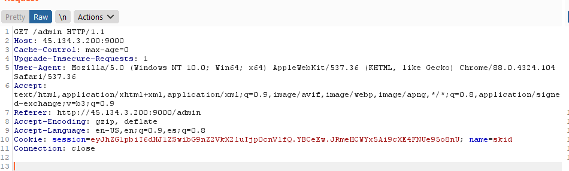

So we change the cookie value to `fernetInjection` to see what happens (send the request to repeater, change value and press send)

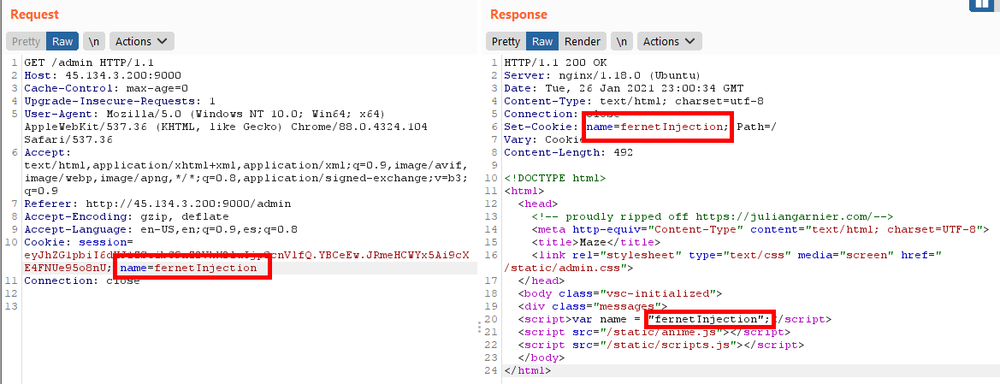

The string we put in cookie name's value is set as value of javascript's variable name. 

We saw that appending `{{}}` to the name returns a 500 error. So, what about template injection then? The best way to confirm there is a template injection vulnerability is to enter math like `{{4*4}}` so when its rendered, the render engine does 4*4=16, so it returns 16.

It seems like the engine takes the value from the cookie and renders it without any validations.

With the help of this image we managed to discover what template engine is used

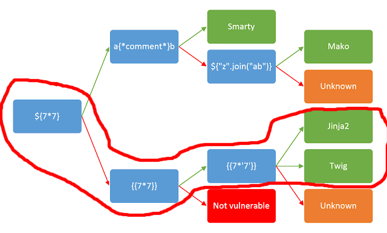

We looked for the worst thing that could happen now: RCE through template injection. 

Googling "jinja2 rce" we found a beautiful blog: https://www.onsecurity.io/blog/server-side-template-injection-with-jinja2/

We tried some payloads and they were successful:

This one tries to read /etc/passwd

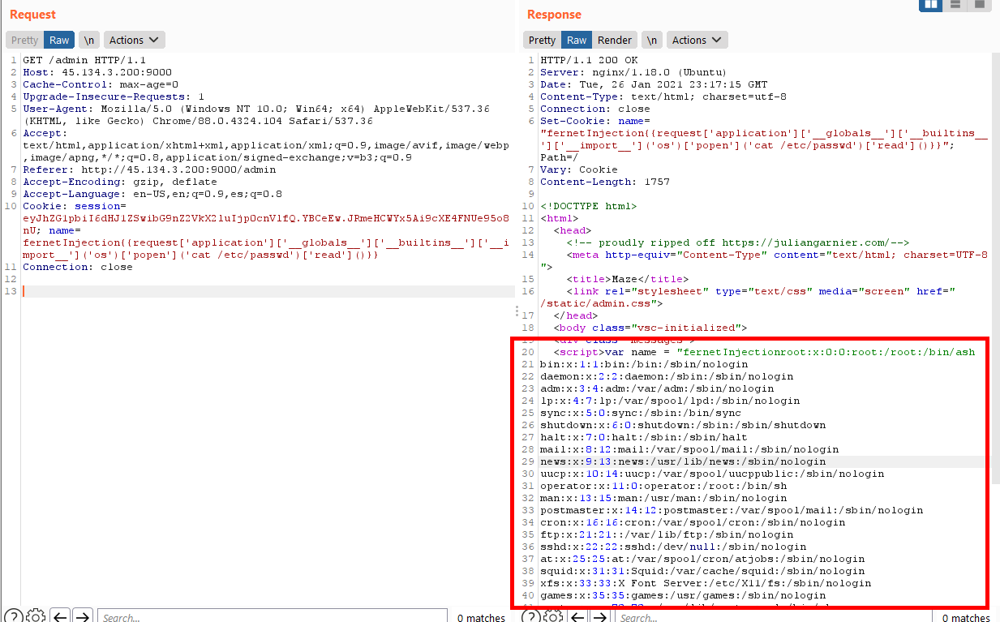


So flag must be in flag.txt somewere.

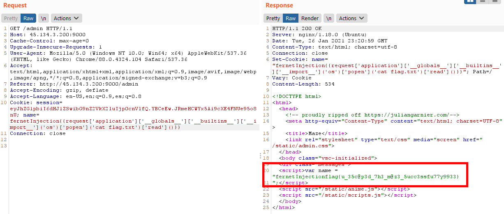


Thats the end!


#### Flag: flag{u_35c@p3d_7h3_m@z3_5ucc3ssfu77y9933}
